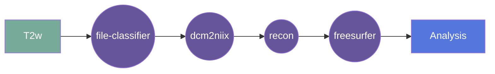

# recon-any

This gear runs recon-any from the development version of FreeSurfer, which performs automated brain segmentation, cortical surface reconstruction, and morphometric analysis from structural MRI data.

## Overview

[Usage](#usage)

[Outputs](#outputs)

[FAQ](#faq)

---

## Summary

This gear takes a structural MRI (e.g., T1-weighted, isotropic image) and runs `recon-any` to generate cortical and subcortical segmentations, surface models, and regional morphometric measurements.

`recon-any` is designed to be more flexible than traditional recon-all workflows and can operate across a wider range of contrasts and acquisition types while still producing FreeSurfer-compatible outputs.

The primary outputs include:

- Cortical and subcortical segmentation volumes
- Surface reconstructions (white, pial, inflated)
- Cortical thickness estimates
- Regional volumetric statistics
- Quality control outputs
- A compressed FreeSurfer subjects directory archive

---

## Inputs

- A structural MRI volume (preferably isotropic, NIfTI format recommended)
- Image should be pre-aligned and skull-stripped if required (depending on workflow configuration)

---

## Outputs

Output filenames follow BIDS-style conventions based on the input filename.

For example, if the input file is:
sub-01_ses-01_T1w.nii.gz

The gear will generate outputs such as:

- `sub-01_ses-01_T1w_seg.nii.gz` — segmentation volume
- `sub-01_ses-01_T1w_vol.csv` — volumetric statistics
- `sub-01_ses-01_T1w_thickness.csv` — cortical thickness summary
- `sub-01_ses-01_T1w_parcellation.nii.gz` — cortical parcellation
- `sub-01_ses-01_T1w_qc.csv` — quality control metrics
- `sub-01_ses-01_T1w_freesurfer.zip` — compressed FreeSurfer output directory

All outputs are also stored in FreeSurfer-compatible format inside the archived subjects directory.

---

## Usage

This gear is intended to be run at the acquisition level on a structural MRI file.

Recommended input characteristics:
- Isotropic resolution (≤1.2 mm preferred)
- Whole-brain coverage
- Minimal motion artifacts

Optional configuration parameters may include:
- OpenMP thread count
- Expert options file
- Additional FreeSurfer flags

---

## Notes

- Runtime depends on resolution and available CPU cores.
- Memory usage scales with image resolution.
- Outputs are compatible with downstream FreeSurfer tools and Flywheel workflows.

---

## Cite

If using recon-any in published work, please cite:

FreeSurfer:
Fischl, B. (2012). FreeSurfer. NeuroImage, 62(2), 774–781.

Cortical analysis of heterogeneous clinical brain MRI scans for large-scale neuroimaging studies. K Gopinath, DN Greeve, S Das, S Arnold, C Magdamo, JE Iglesias

SynthSeg: Segmentation of brain MRI scans of any contrast and resolution without retraining. B Billot, DN Greve, O Puonti, A Thielscher, K Van Leemput, B Fischl, AV Dalca, JE Iglesias. Medical Image Analysis, 83, 102789 (2023).

Robust machine learning segmentation for large-scale analysis of heterogeneous clinical brain MRI datasets. B Billot, C Magdamo, SE Arnold, S Das, JE Iglesias. PNAS, 120(9), e2216399120 (2023).

SynthSR: a public AI tool to turn heterogeneous clinical brain scans into high-resolution T1-weighted images for 3D morphometry. JE Iglesias, B Billot, Y Balbastre, C Magdamo, S Arnold, S Das, B Edlow, D Alexander, P Golland, B Fischl. Science Advances, 9(5), eadd3607 (2023).

### Classification

*Category:* analysis

*Gear Level:*

* [ ] Project
* [x] Subject
* [x] Session
* [ ] Acquisition
* [ ] Analysis

----

### Inputs

* api-key
  * **Name**: api-key
  * **Type**: object
  * **Optional**: true
  * **Classification**: api-key
  * **Description**: Flywheel API key.

### Config

* input
  * **Base**: file
  * **Description**: input file (usually isotropic reconstruction)
  * **Optional**: false

### Outputs
* output
  * **Base**: file
  * **Description**: segmentated file 
  * **Optional**: false

* parcelation
  * **Base**: file
  * **Description**: parcelation file 
  * **Optional**: true

* vol
  * **Base**: file
  * **Description**: volume estimation file (csv)
  * **Optional**: true

* QC
  * **Base**: file
  * **Description**: QC file (csv)
  * **Optional**: true
  
* Cortical Thickness
  * **Base**: file
  * **Description**: Thickness estimation file (csv)
  * **Optional**: true

* Freesurfer archive zip
  * **Base**: file
  * **Description**: archive of Freesurfer intermediary output (zip)
  * **Optional**: true

#### Metadata

No metadata currently created by this gear

### Pre-requisites

- Three dimensional structural image

#### Prerequisite Gear Runs

This gear runs on BIDS-organized data. To have your data BIDS-ified, it is recommended
that you run, in the following order:

1. ***dcm2niix***
    * Level: Any
2. ***file-metadata-importer***
    * Level: Any
3. ***file-classifier***
    * Level: Any

#### Prerequisite

## Usage

This section provides a more detailed description of the gear, including not just WHAT
it does, but HOW it works in flywheel

### Description

This gear is run at either the `Subject` or the `Session` level. It downloads the data for that subject/session and then runs the
`recon-any` pipeline on it.

After the pipeline is run, the output folder is zipped and saved into the analysis
container.

#### File Specifications

This section contains specifications on any input files that the gear may need

### Workflow

A picture and description of the workflow

Description of workflow

1. Upload data to container
2. Prepare data by running the following gears:
   1. file classifier
   2. dcm2niix
   3. Multi-Resolution Reconstruction (MRR) {for Hyperfine Swoop data}
3. Run the recon-any gear
4. Output data is saved in the container
5. 
### Use Cases

## FAQ

[FAQ.md](FAQ.md)

## Contributing

[For more information about how to get started contributing to that gear,
checkout [CONTRIBUTING.md](CONTRIBUTING.md).]

Note: This gear uses the FreeSurfer development version. 
Behavior and outputs may differ from stable releases (e.g., v7.4.x).
Results may change as the development branch evolves.
